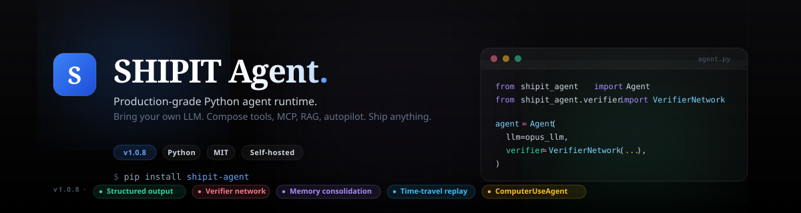

<p align="center">
  
</p>

<p align="center">
  
</p>

<h1 align="center">SHIPIT Agent</h1>

<p align="center">
  <strong>A clean, powerful, open-source Python runtime for building tool-using AI agents.</strong>
</p>

<p align="center">
  <em>One consistent API over every major LLM provider — with tools, skills, memory, MCP,
  a rule-based permission layer, prompt caching, deep multi-agent orchestration, RAG,
  and structured streaming events.</em>
</p>

<p align="center">
  <a href="https://docs.shipiit.com/"><strong>📖 Documentation</strong></a> ·
  <a href="https://pypi.org/project/shipit-agent/"><strong>📦 PyPI</strong></a> ·
  <a href="https://docs.shipiit.com/getting-started/quickstart/">Quick start</a> ·
  <a href="CHANGELOG.md">Changelog</a> ·
  <a href="SECURITY.md">Security</a>
</p>

<p align="center">
  <a href="https://pypi.org/project/shipit-agent/"></a>
  <a href="https://pypi.org/project/shipit-agent/"></a>
  <a href="https://pypi.org/project/shipit-agent/"></a>
  <a href="LICENSE.md"></a>
  <a href="https://docs.shipiit.com/"></a>
</p>

<p align="center">
  
  
  
  
  
  
  
  
  
</p>

---

## What is SHIPIT Agent?

SHIPIT Agent is a small, explicit runtime for building production agents in Python. You bring
an LLM; the runtime gives you the loop around it — tool calling, retries, streaming, memory,
sessions, permissions, and cost tracking — plus a deep library of batteries (40+ built-in tools,
17 SaaS connectors, RAG, multi-agent orchestration, browser automation).

It is **provider-agnostic by design**: the same agent code runs on OpenAI, Anthropic, AWS Bedrock,
Google Vertex/Gemini, Groq, Together, Ollama, or any of 100+ models through LiteLLM. Swap the model
in one line — nothing else changes.

```python
from shipit_agent import Agent
from shipit_agent.llms import build_llm_from_env

agent = Agent.with_builtins(llm=build_llm_from_env())   # any provider
print(agent.run("Find every TODO in this repo and summarize them.").output)
```

> The only hard dependency is `pydantic`. Everything else (a provider SDK, Playwright, a vector
> store) is an optional extra you install when you need it. **Python 3.11+ · MIT · 1850+ tests.**

---

## Highlights

- **🤖 The Agent** — one runtime: tool calling, retries, parallel tools, context compaction, and a
  final-answer guarantee. `Agent.with_builtins()` ships the full tool catalogue.
- **🔌 Any LLM** — OpenAI · Anthropic · Bedrock · Vertex · Gemini · Groq · Together · Ollama ·
  OpenRouter · 100+ via LiteLLM. Native adapters where it matters, one interface everywhere.
- **🛡️ Control plane** — a fast, rule-based **permission engine** (allow/deny/ask), **plan mode**
  (read-only research before acting), and **hooks that can block or rewrite** any tool call.
- **⚡ Prompt caching** — cross-provider cache-read accounting (Anthropic/Bedrock/Vertex
  `cache_control` + OpenAI automatic caching) so repeated calls bill at a fraction of the cost.
- **🧰 Tools & connectors** — 40+ built-in tools (bash, SQL, files, web search, code execution,
  vision, PDF…) and 17 SaaS connectors (GitHub, Slack, Gmail, Jira, Salesforce, Stripe…).
- **🔗 MCP** — connect Model Context Protocol servers over stdio, HTTP, or a persistent subprocess.
- **🧠 Deep agents** — `GoalAgent`, `ReflectiveAgent`, `Supervisor`/`Worker`, `ShipCrew`, and the
  `create_deep_agent()` factory for autonomous, multi-step, multi-agent work.
- **📚 Super RAG** — hybrid vector + BM25 search with auto-cited sources and pluggable backends
  (Chroma, Qdrant, pgvector).
- **🚀 Autopilot** — long-running autonomous loops with a critic, artifacts, fan-out, and a scheduler.
- **🖥️ Computer use** — drive a real browser via screenshots + a vision model (works in Jupyter).
- **📊 Production-ready** — sessions, memory consolidation, structured output with validation-retry,
  streaming events (+ SSE/WebSocket packets), tracing (file/OTel/LangSmith), and budgets.

---

## What's new in v1.0.15 — The Super Agent

One release that makes a shipit agent useful to **every sector** — and makes every run readable.
All of it works with any LLM provider.

```python
from shipit_agent import Agent, AgentScheduler, connect_mcp, format_activity

# 1. Sector specialists in one line — finance, marketing, engineering, design, research, sales…
agent = Agent.for_role("finance-analyst", llm=llm)

# 2. Prebuilt MCP catalog — 12 well-known servers by name, validated up front
agent = Agent.for_role("finance-analyst", llm=llm,
                       mcps=[connect_mcp("postgres", args=["postgresql://localhost/finance"])])

# 3. Real deliverables — polished PDF / Excel (live formulas) / Word / PowerPoint / HTML
result = agent.run("Close Q2: P&L workbook with a net-income formula + a board deck.")

# 4. Claude-Code-style tool logs — cards with args, ✓/✗, duration, output preview
print(format_activity(result))     # ⚙ build_document(kind="xlsx", …) ✓ 228ms
print(result.summary())            # duration, iterations, per-tool ms, token usage

# 5. Scheduled jobs — cron for agents (durable with SQLiteJobStore)
sched = AgentScheduler(agent)
sched.add("Rebuild the close package.", at="07:00")
sched.run_forever()
```

Plus: MCP **resources & prompts** + the 2025 **streamable-HTTP** transport (bearer auth),
**background subagents** (`background=true` → task id → `collect`), live-updatable tool events
(`call_id` correlation), and observable **context compaction**.
See the [full guide](https://docs.shipiit.com/guides/super-agent/) and [changelog](CHANGELOG.md).

---

## The shipit CLI

```bash
shipit code "fix the failing test"     # 🛠 coding agent in your repo
shipit browse --show "cheapest SFO→JFK flight?"   # 🌐 computer use, watchable
shipit run "prompt"                    # one-shot with live tool cards
shipit chat                            # REPL with bottom-pinned input (TUI)
shipit serve                           # your agent as an OpenAI-compatible API
shipit code --mcp playwright "..."     # attach MCP servers (browser & more)
shipit roles | models | mcp | tools    # catalogs
```

`shipit code` roots the agent in your repository — project memory, slash
commands, permission policy, 50 builtin tools (structured `git_ops`,
`notebook_edit`, hardened edits with diffs, `deep_research`, …) — with
human-in-the-loop [y]/[n]/[a]lways prompts, `--plan` (read-only) and
`--yes` (auto-accept) modes, self-healing tool calls for open-weight
models, and `--mcp` to attach catalog servers incl. the official
Playwright MCP. [Full CLI guide →](https://docs.shipiit.com/guides/shipit-cli/)

---

## Installation

**Requirements:** Python **3.11+** (3.11 – 3.14 supported). The only hard dependency is
`pydantic`; provider SDKs and heavier features are opt-in extras.

### From PyPI (recommended)

```bash
pip install shipit-agent
```

### Optional extras

Install only what you need — each extra pulls in the relevant third-party packages:

| Extra | Installs | For |
| --- | --- | --- |
| `openai` | `openai` | OpenAI / OpenAI-compatible |
| `anthropic` | `anthropic` | native Anthropic (Claude) |
| `bedrock` | `boto3` | AWS Bedrock |
| `google` | `google-generativeai` | Gemini |
| `groq` / `together` / `ollama` | provider SDK | Groq / Together / Ollama |
| `litellm` | `litellm` | 100+ models via one interface |
| `playwright` | `playwright` | browser automation / computer use |
| `pdf` | `pypdf` | the PDF tool |
| `sql` | `sqlalchemy` | the SQL tool (add your own driver) |
| `rag-chroma` / `rag-qdrant` / `rag-pgvector` | vector store | RAG backends |
| `rag-openai` / `rag-cohere` / `rag-sentence-transformers` | embedder | RAG embeddings |
| `otel` / `langsmith` | exporters | tracing |
| `all` | everything | kitchen sink |

```bash
pip install "shipit-agent[anthropic]"        # one provider
pip install "shipit-agent[anthropic,playwright,rag-chroma]"   # combine
pip install "shipit-agent[all]"              # everything
```

> **Browser automation / computer use** also needs the Chromium binary:
> ```bash
> pip install "shipit-agent[playwright]" && playwright install chromium
> ```

### From source (development)

```bash
git clone https://github.com/shipiit/shipit_agent.git
cd shipit_agent
pip install -e ".[dev]"     # editable install with test/docs tooling
pytest -q                   # 1850+ tests
ruff check .
```

Alternatives: `pip install .` (non-editable), `pip install -r requirements.txt`, or
`poetry install`.

### Verify

```python
import shipit_agent
print(shipit_agent.__version__)
```

> **Notebook tip:** if imports look out of date, your kernel may be using an older globally
> installed copy. Run `pip install -U shipit-agent` (or `pip install -e .` from the repo) in the
> kernel's environment.

---

## Environment setup

The fastest way to choose a model is environment variables — copy
[`.env.example`](.env.example) to `.env` and fill in what you use:

```bash
# Pick the provider; build_llm_from_env() reads these:
SHIPIT_LLM_PROVIDER=bedrock            # openai | anthropic | bedrock | vertex | gemini | groq | together | ollama | litellm

# …then the provider's own credentials, e.g.:
OPENAI_API_KEY=sk-...
ANTHROPIC_API_KEY=sk-ant-...
AWS_REGION_NAME=us-east-1             # Bedrock uses your AWS region / profile (no key)
SHIPIT_BEDROCK_MODEL=bedrock/us.anthropic.claude-3-5-sonnet-20240620-v1:0
GEMINI_API_KEY=...
GROQ_API_KEY=...
SHIPIT_LITELLM_MODEL=openrouter/openai/gpt-4o-mini    # for the litellm provider
```

```python
from shipit_agent import Agent
from shipit_agent.llms import build_llm_from_env

agent = Agent.with_builtins(llm=build_llm_from_env())   # reads SHIPIT_LLM_PROVIDER + creds
print(agent.run("Hello, who are you?").output)
```

Run diagnostics any time with `agent.doctor()` to check provider config, credentials, and tools.

---

## Use any LLM provider

The agent never cares which model it talks to. Configure once via env, or instantiate an adapter
directly:

```python
from shipit_agent.llms import (
    build_llm_from_env, OpenAIChatLLM, AnthropicChatLLM,
    BedrockChatLLM, GeminiChatLLM, GroqChatLLM, LiteLLMChatLLM,
)

llm = build_llm_from_env("bedrock")                       # env-driven (prod)
llm = OpenAIChatLLM(model="gpt-4o")                       # native OpenAI
llm = AnthropicChatLLM(model="claude-opus-4-1")           # native Anthropic
llm = BedrockChatLLM(model="bedrock/us.meta.llama4-maverick-17b-instruct-v1:0")
llm = GeminiChatLLM(model="gemini/gemini-2.0-flash")
llm = GroqChatLLM(model="groq/llama-3.3-70b-versatile")
llm = LiteLLMChatLLM(model="together_ai/meta-llama/Llama-3.1-70B-Instruct-Turbo")
```

| Provider | Adapter | Env (`SHIPIT_LLM_PROVIDER=`) | Auth |
| --- | --- | --- | --- |
| OpenAI | `OpenAIChatLLM` | `openai` | `OPENAI_API_KEY` |
| Anthropic | `AnthropicChatLLM` | `anthropic` | `ANTHROPIC_API_KEY` |
| AWS Bedrock | `BedrockChatLLM` | `bedrock` | AWS region / profile |
| Google Vertex | `VertexAIChatLLM` | `vertex` | service-account JSON |
| Gemini | `GeminiChatLLM` | `gemini` | `GEMINI_API_KEY` |
| Groq | `GroqChatLLM` | `groq` | `GROQ_API_KEY` |
| Together | `TogetherChatLLM` | `together` | `TOGETHERAI_API_KEY` |
| Ollama (local) | `OllamaChatLLM` | `ollama` | — |
| LiteLLM / OpenRouter | `LiteLLMChatLLM` / `LiteLLMProxyChatLLM` | `litellm` | per provider |

---

## Claude, end to end

Everything below is optional — `AnthropicChatLLM(model=…)` on its own is a
working agent. This is what is available when you want more from Claude
specifically.

### Install and authenticate

```bash
pip install "shipit-agent[anthropic]"
export ANTHROPIC_API_KEY=sk-ant-...
```

| Model | Use it for |
| --- | --- |
| `claude-opus-5` | the most capable, for complex multi-step agents |
| `claude-sonnet-5` | the default — the balance of speed and intelligence |
| `claude-haiku-4-5-20251001` | the fastest and cheapest, for high-volume jobs |

`shipit models` prints this list, and `--model` or `$SHIPIT_ANTHROPIC_MODEL`
overrides it anywhere.

### From the CLI

```bash
export SHIPIT_LLM_PROVIDER=anthropic          # or pass --provider anthropic

shipit run "Summarise this repo" --provider anthropic
shipit chat --provider anthropic              # REPL, bottom-pinned input
shipit code "fix the failing test" --provider anthropic --model claude-opus-5
shipit serve --provider anthropic             # OpenAI-compatible API, Claude behind it

shipit doctor --provider anthropic            # names the variable it wants
```

`doctor` is the one to reach for when something is wrong: it reports the
adapter, the resolved model and the exact missing environment variable,
and exits non-zero — so `shipit doctor --provider anthropic && shipit serve`
stops rather than starting a server that cannot answer.

### Extended thinking

Give Claude a budget to reason before it replies. `interleaved_thinking`
lets it think *between* tool calls rather than only before the first —
useful when each result should change the plan, and ignored unless a
thinking budget is set, because there is nothing to interleave without one.

```python
from shipit_agent import Agent
from shipit_agent.llms import AnthropicChatLLM

llm = AnthropicChatLLM(
    model="claude-opus-5",
    thinking_budget_tokens=4096,
    interleaved_thinking=True,
)
agent = Agent.with_builtins(llm=llm)
```

### Prompt caching is already on

`prompt_caching=True` is the default. The adapter marks the system prompt
and the tool schemas as cacheable, which is the part of the request that
repeats verbatim on every turn — on a long agent run it is most of the
input. Pass `prompt_caching=False` to switch it off.

### Server-side tools

Tools Anthropic runs on its own infrastructure, so nothing executes on your
machine and no result has to travel through your process:

These are declarations passed to the adapter alongside your own tools, so
they live at the LLM layer rather than in the agent's toolbox:

```python
from shipit_agent.llms import AnthropicChatLLM, code_execution, web_search

llm = AnthropicChatLLM(model="claude-sonnet-5")
response = llm.complete(
    messages=messages,
    tools=[web_search(max_uses=3), code_execution()],
)
print(response.metadata["server_tool_use"])       # what Claude ran
print(response.metadata["server_tool_results"])   # what came back
```

`bash()`, `text_editor()` and `computer_use(width, height)` are available the
same way. Beta headers are attached only when a tool needs one — `web_search`
is generally available, so a request using it stays on the GA endpoint and is
identical to one without this feature.

### Citations from your own documents

Attach sources and get back claims with the span each came from, rather
than a summary you have to spot-check:

```python
import base64

from shipit_agent.llms import AnthropicChatLLM, pdf_document, text_document

pdf = base64.b64encode(open("10-K.pdf", "rb").read()).decode()

llm = AnthropicChatLLM(
    model="claude-sonnet-5",
    documents=[pdf_document(pdf, title="FY25 10-K"),
               text_document("Revenue grew 14% YoY.", title="Board note")],
)
response = llm.complete(messages=messages)
for citation in response.metadata.get("citations", []):
    print(citation)     # {"type": "page_location", "cited_text": …, "document_title": …}
```

`pdf_document()` takes base64 — `url_pdf_document()` has the API fetch it
instead, and `content_document()` takes in-memory content blocks. Every one
sets `citations=True` by default.

### Context management

Let the API drop stale tool results server-side on a long run, instead of
resending a transcript that grows every turn:

```python
llm = AnthropicChatLLM(
    model="claude-sonnet-5",
    context_management={"edits": [{"type": "clear_tool_uses_20250919"}]},
)
```

The required beta header is added for you when this is set.

### Claude through Bedrock

Same models, your AWS account, no Anthropic key:

```bash
shipit run "…" --provider bedrock --model bedrock/anthropic.claude-sonnet-5-v1:0
```

```python
from shipit_agent.llms import BedrockChatLLM

llm = BedrockChatLLM(model="bedrock/anthropic.claude-sonnet-5-v1:0")
```

Bedrock authenticates with your AWS region and profile — see
`bedrock/anthropic.claude-haiku-4-5-v1:0` in `shipit models` for the cheaper
route.

---

## Core building blocks

### Custom tools

Wrap any Python callable — the agent reads its signature and calls it when useful:

```python
from shipit_agent import Agent, FunctionTool

def get_weather(city: str) -> str:
    """Current weather for a city."""
    return f"{city}: 22°C, clear"

agent = Agent.with_builtins(llm=llm, tools=[FunctionTool.from_callable(get_weather)])
agent.run("What's the weather in Tokyo — umbrella?")
```

### Skills

Reusable behaviour templates that shape *how* the agent thinks and *which* tools it reaches for:

```python
agent = Agent.with_builtins(
    llm=llm,
    skills=["code-workflow-assistant", "database-architect"],
    auto_use_skills=True,      # activate authored trigger phrases
)
```

### Sessions & memory

```python
session = agent.chat_session(session_id="user-42")
session.send("My name is Ada. I build compilers.")
session.send("What was my name again?")          # → remembers across turns
```

Persist across processes with `FileSessionStore`, and distill conversations into durable facts
with `MemoryConsolidator`.

### Structured output

```python
from pydantic import BaseModel

class Ticket(BaseModel):
    title: str; priority: str; tags: list[str]

result = agent.run("Triage: 'login broken on Safari'", output_schema=Ticket)
print(result.parsed)            # validated; auto-retries inside the same conversation
```

### Streaming

```python
for event in agent.stream("Write a haiku about shipping code"):
    if event.type == "text_delta":
        print(event.payload["chunk"], end="", flush=True)
    elif event.type == "tool_output_delta":
        print(event.payload["chunk"], end="", flush=True)
    elif event.type == "tool_called":
        print("→", event.payload["tool"])
```

Events also serialize to ready-made **SSE / WebSocket** packets for web UIs.

---

## The control plane

A Claude Code-style safety layer — rule-based, no extra LLM call.

```python
from shipit_agent import Agent, PermissionEngine

agent = Agent.with_builtins(
    llm=llm,
    permissions=PermissionEngine(
        deny=["bash", "*_delete"],   # never run these
        ask=["sql"],                 # require approval
        allow=["read*", "grep*"],    # always fine
    ),
)

# Read-only "plan mode" — research and propose, take no action:
plan = agent.plan("Migrate the billing schema to multi-tenant.").output
```

- **Modes:** `default`, `acceptEdits`, `plan`, `bypass`.
- **`permission_callback(name, args)`** for programmatic human-in-the-loop approval.
- **Blocking hooks** — `before_tool` hooks can **deny** a call or **rewrite its arguments**;
  `on_user_prompt` can redact prompts:

```python
@hooks.on_before_tool
def guard(name, args):
    if name == "bash" and "rm -rf" in args.get("command", ""):
        return {"decision": "deny", "reason": "destructive command"}
```

---

## Performance: prompt caching

The runtime rebuilds the same system prompt + tool schemas each turn — the ideal cacheable prefix.

```python
from shipit_agent.llms import AnthropicChatLLM
llm = AnthropicChatLLM("claude-opus-4-1", prompt_caching=True)   # default on for Claude
```

Provider-aware adapters cache the stable tools + system prefix without sending
incompatible fields. Anthropic, Bedrock Claude, and Gemini/Vertex use explicit
markers; OpenAI-style providers use automatic caching. Responses surface
`cache_read_input_tokens` / `cache_creation_input_tokens` and a truthful
`prompt_cache` status, which flow into `CostTracker`. See
[Context management](docs/guides/context-management.md#provider-aware-cache-configuration).

Large tool and MCP catalogs use progressive discovery automatically, including
plain `Agent(tools=[...], mcps=[...])` construction. The optimized project
preset additionally turns on model-aware checkpoint compaction and durable
state:

```python
agent = Agent.for_project(
    llm=llm,
    project_root="/path/to/repo",
    optimized=True,
)

# Reuse this id after a process restart to continue the same durable chat.
chat = agent.chat_session(session_id="main")
chat.send("Review the authentication flow")
chat.send("Now implement the fixes and run the tests")
```

Run `agent.doctor()` to verify tool schemas, skill dependencies, MCP and
connector readiness, prompt caching, code mode, and compaction settings.
Optimized project agents keep canonical chat history in `.shipit/sessions/`
and long-term facts in `.shipit/memory.json`; only the compact replay sent to
the model is shortened, so historical messages remain available to the user.
Large MCP/tool outputs are similarly bounded only in model context; complete
results remain available through `AgentResult.tool_results` and event traces.
Every tool also emits `tool_output_started` and `tool_output_delta` events.
Existing tools and MCP calls produce a delta when their final response arrives;
custom generator tools can yield `ToolOutputChunk` values for true incremental
output. Guardrail-enabled runs buffer first and publish only sanitized output.

---

## Deep agents & orchestration

```python
from shipit_agent import create_deep_agent, Goal

# Autonomous goal decomposition with a planner / explorer / coder / verifier loop:
agent = create_deep_agent(llm=llm, tools=[...])
result = agent.run(Goal(objective="Build and test a REST API for todos"))
```

`GoalAgent` (decompose → execute), `ReflectiveAgent` (self-improve to a quality bar),
`Supervisor` + `Worker` (hierarchical), `ShipCrew` (role-based crews), `AdaptiveAgent`, and
`PersistentAgent` (checkpoint + resume) are all first-class.

## Super RAG

```python
from shipit_agent import RAG, Agent
from shipit_agent.rag.embedder import HashingEmbedder

rag = RAG.default(embedder=HashingEmbedder())
rag.index_text("Payments run on Stripe; refunds settle in 5–7 days.", source="ops.md")

agent = Agent.with_builtins(llm=llm, rag=rag)     # retrieves, then answers with cited sources
print(agent.run("How long do refunds take?").rag_sources)
```

Hybrid vector + BM25 ranking, a document chunker, multiple embedders/rerankers, and pluggable
backends (Chroma, Qdrant, pgvector).

## Autopilot, computer use & connectors

```python
# Drive a real browser (works in Jupyter):
from shipit_agent.computer_use import ComputerUseAgent, PlaywrightBrowserSession

with PlaywrightBrowserSession.launch(headless=True) as browser:
    ComputerUseAgent(llm=claude_llm, browser=browser,
                     goal="Find the iPhone 15 Pro price on apple.com").run()
```

**Autopilot** runs long, unattended jobs with a critic, artifacts, fan-out, and a scheduler.
**17 SaaS connectors** — GitHub, GitLab, Slack, Gmail, Google Drive/Sheets/Calendar, Jira, Linear,
Notion, Confluence, HubSpot, Salesforce, Stripe, Zendesk, Figma, LinkedIn — share a credential store
with built-in OAuth helpers.

## MCP

```python
from shipit_agent import Agent, connect_mcp

github = connect_mcp("github")                      # needs GITHUB_TOKEN
files  = connect_mcp("filesystem", args=["/my/project"])
agent  = Agent.with_builtins(llm=llm, mcps=[github, files])
```

A **prebuilt catalog** of 12 well-known servers (GitHub, Slack, Postgres, filesystem, Puppeteer,
Brave search, …) connects by name with fail-fast env/launcher validation — or bring your own
server over **stdio**, **HTTP**, a **persistent subprocess**, or the 2025 **streamable-HTTP** spec
(`MCPStreamableHTTPTransport`, with `bearer_token=` for hosted servers). Beyond tools, servers'
**resources and prompt templates** are first-class (`list_resources()` / `read_resource()` /
`get_prompt()` / `resource_tool()`).

---

## Observability & cost

- **Tracing** — `FileTraceStore`, OpenTelemetry, and LangSmith exporters.
- **Cost & budgets** — `CostTracker` prices every call from a model table; `Budget` enforces a
  ceiling (and flags unknown-model pricing instead of silently billing $0).
- **Verifier network** — an optional cheap LLM that vetoes hallucinated tool calls and detects
  stalling, complementing the rule-based permission engine.

---

## Examples & notebooks

- **[`examples/`](examples/)** — runnable scripts (basic agent, custom tools, parallel tools,
  cost budgets, multi-turn memory, async runtime, secure tools, the verifier guard, and more).
- **[`notebooks/`](notebooks/)** — 60+ Jupyter notebooks covering agents, streaming, MCP,
  connectors, deep agents, RAG, skills, autopilot, the control plane, prompt caching, and the
  memory tool.

```bash
python examples/run_multi_tool_agent.py
```

---

## Documentation

- 🌐 **[Full documentation site](https://docs.shipiit.com/)** — searchable, with guides for every
  subsystem.
- 📓 **[CHANGELOG.md](CHANGELOG.md)** · **[release-notes/](release-notes/)** — per-release detail.
- 🧰 **[TOOLS.md](TOOLS.md)** — the built-in tool catalogue.
- 🔐 **[SECURITY.md](SECURITY.md)** · ⚖️ **[LICENSE.md](LICENSE.md)** (MIT).

## Contributing

Issues and PRs are welcome. Install the dev extras, keep the suite green, and run the linter:

```bash
pip install -e ".[dev]"
pytest -q
ruff check .
```

See **[CONTRIBUTING.md](CONTRIBUTING.md)** for the full guide.

---

<p align="center">
  
  <br />
  <strong>Built with Love. Powered by your choice of AI models.</strong>
  <br />
  <sub>Ship it fast. Ship it right.</sub>
</p>
